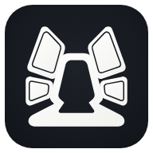
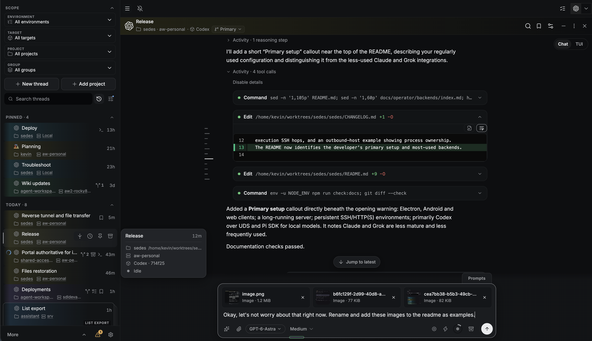
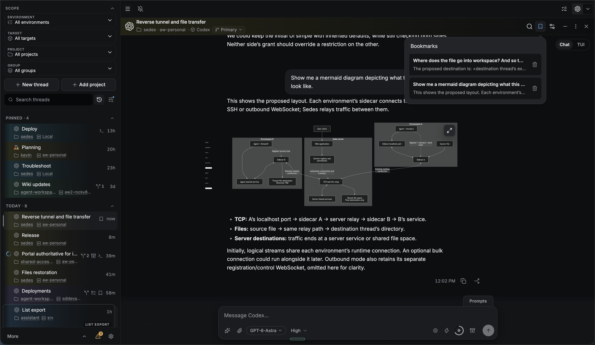
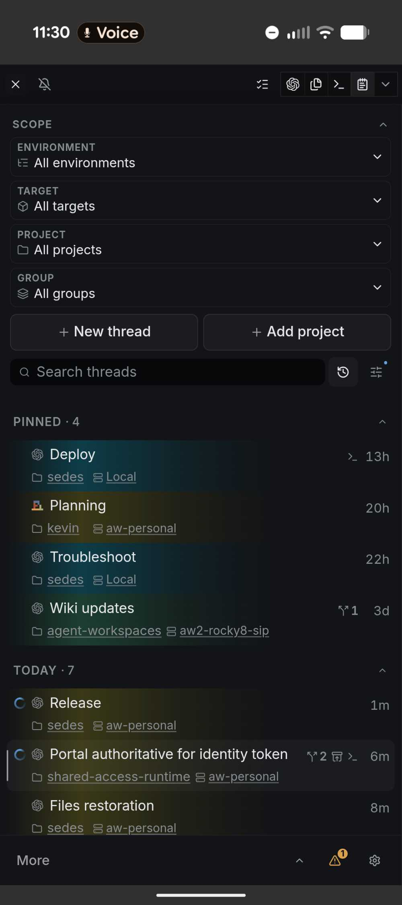
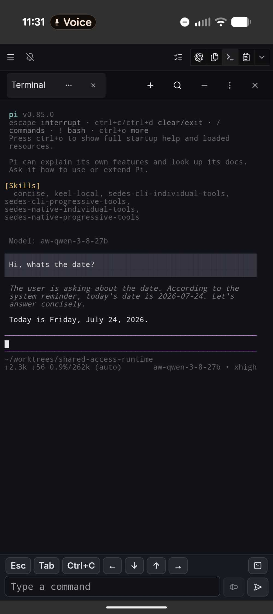

# Sedes

<p align="center">
  
</p>

> [!WARNING]
> Sedes is an experimental, opinionated tool built primarily for its
> maintainer's own agent-development workflow and shared in case it is useful
> to others. It is not intended to become a general-purpose collaboration
> platform or a broad community project. Its interfaces, supported workflows,
> and performance may not suit other users or may change as the project
> evolves.

> [!NOTE]
> **Primary setup:** The developer regularly uses Electron, Android, and web
> clients connected to a long-running Sedes server on Linux, with persistent remote
> environments reached over SSH or HTTP(S). Most day-to-day use is Codex via
> an external app-server's Unix-domain socket (UDS), plus Pi SDK for local
> models. These workflows receive the most everyday use. Claude and Grok are
> less mature integrations and are used less often. See the
> [connection guide](docs/operator/connections.md) for how the layers fit together.

Sedes is a self-hosted **agent development environment (ADE)** for running,
observing, organizing, and controlling coding agents. It brings Pi SDK, Codex,
Claude, and Grok conversations into one browser interface with durable drafts,
queues, tasks, reusable configurations, file context, automations, and recovery
when a provider operation has an uncertain outcome. Thread-associated terminal
resources can keep running without an open panel and can be reopened from
another browser or packaged client. Remote sidecar-owned work and terminal
processes can outlive a main-server restart or a lost SSH or outbound connector
connection.

Sedes does not accept pull requests, so please do not spend time or tokens
preparing one. Report reproducible bugs as
[GitHub Issues](https://github.com/kcosr/sedes/issues). Use
[GitHub Discussions](https://github.com/kcosr/sedes/discussions) for feature
requests and questions, including whether a change you would like to make
would be accepted. See [Contributing](CONTRIBUTING.md) for how the repository
is maintained.





<p>
  
  
</p>

> [!IMPORTANT]
> Sedes requires passwordless pairing by default. An explicit server startup
> override can disable authentication; see [authentication settings](docs/operator/configuration.md). Keep the server
> on loopback unless you deliberately use one of the private access boundaries
> documented in [Operations and security](docs/operator/operations.md). Do not
> expose it to the public internet.

> [!NOTE]
> Some users may find current cold-load and reattachment performance
> unacceptable, especially with large or old provider conversations, slower
> provider stores, remote topology, or constrained hardware. This follows in
> part from the deliberate choice to keep the canonical transcript with each
> provider instead of mirroring it into SQL. Read
> [Provider-owned conversation state](docs/internals/provider-owned-conversation-state.md)
> before evaluating or reporting performance.

## Current status

Sedes runs on **Windows, macOS, and Linux**, with different deployment options:

| Platform | Available setup |
| --- | --- |
| Windows | Standalone server with limited support; Electron desktop client with a managed local server or a connection to a remote server; browser client; outbound execution host. |
| macOS | Standalone server on Apple silicon or Intel; Electron desktop client with a managed local or remote server; browser client; outbound execution host. |
| Linux | Standalone server on x64; Electron desktop client with a managed local or remote server; browser client; outbound execution host. |
| Android | Packaged client connecting to a server. |

The standalone server supports Linux and macOS, with **limited Windows support**
based on limited use by the developer. Windows also supports
[Electron Managed Local](docs/operator/clients/electron.md#use-managed-local).
The standalone source-server instructions below target Linux and macOS and
require Node.js 24.18 or newer. See [Outbound hosts](docs/operator/outbound-hosts.md)
for remote execution prerequisites and backend limitations.

The Android and Electron projects are buildable previews; the repository does
not publish signed or notarized client binaries.

The repository does not publish an npm package, server archive, container
image, or stable upgrade channel. Provider compatibility is deliberately
bounded and is documented in the individual
[backend guides](docs/operator/backends/index.md).

## What Sedes provides

| Area              | What you can do                                                                                                                                                                              |
| ----------------- | -------------------------------------------------------------------------------------------------------------------------------------------------------------------------------------------- |
| Conversations     | Work with Pi SDK, Codex, Claude, and Grok through one interface.                                                                                                                                 |
| Active work       | Keep durable drafts, Send or Stop work, and use Steer or Queue when the selected backend supports them.                                                                                      |
| Organization      | Arrange threads by project, group, pin, state, time, bookmarks, and tasks.                                                                                                                   |
| Reuse             | Create saved Agents, thread templates, saved prompts, skills, and context excerpts.                                                                                                          |
| Workspace context | Browse and edit files, inspect Git changes, attach inputs, and connect file references to tasks and prompts.                                                                                 |
| Durable workflows | Fork conversations, schedule automations, recover uncertain operations, and retain application state across restarts.                                                                        |
| Agent access      | Let coding agents use an explicit, auditable subset of Sedes operations.                                                                                                                     |
| Terminals         | Run local or capable SSH/outbound sidecar shells, close client-local panels without stopping them, take control from another device, and reopen bounded retained screen state.                        |
| Clients           | Use the browser directly or build the included Android and Electron preview clients; Electron can run one app-session Local server or connect through named Direct and managed-SSH profiles. |

## Supported backends

| Backend | Current integration                                                                                            | Execution boundary                                                                                                        |
| ------- | -------------------------------------------------------------------------------------------------------------- | ------------------------------------------------------------------------------------------------------------------------- |
| Pi SDK  | Sedes hosts the Pi SDK and uses the authenticated local Pi installation.                                       | Local runtime; an optional SSH or outbound operations sidecar can provide remote workspace tools, Files, and bounded skill discovery. |
| Codex   | Sedes can own a local process or connect to an operator-managed local, authenticated network, or SSH/outbound sidecar endpoint. | Local or persistent-sidecar execution, depending on the configured topology.                                                             |
| Claude  | Sedes runs a managed Claude Agent SDK worker with an independently authenticated Claude Code CLI.              | Local worker or persistent-sidecar runtime over SSH or outbound on Linux/macOS.                                  |
| Grok    | Sedes owns a local Grok ACP process using the native installation account.                                     | Local execution environment.                                                                                              |

Remote hosts can also call the server over HTTP or HTTPS through an outbound
connector. Accept a pending host in Settings, grant roots and operations, then
add supported backends. See [Outbound hosts](docs/operator/outbound-hosts.md)
for macOS, Linux, and Windows prerequisites and validation limits.

Backend availability and controls are capability-driven. See
[Backend setup and support](docs/operator/backends/index.md) for exact release
ranges, authentication requirements, features, and unsupported paths.

## Quick start with Pi

The shortest supported path runs Sedes from source, then adds Pi SDK in
Settings. You need:

- Linux x64, or macOS on Apple silicon or Intel
- Node.js 24.18 or newer;
- npm 11 or another version compatible with the lockfile; and
- at least one authenticated provider/model in Pi's native environment for the
  same operating-system account that will run Sedes. The pinned Pi SDK is
  already installed as a Sedes dependency; no separate Pi RPC service is
  required.

Clone the repository, install with `NODE_ENV` unset, and start the development
client and server:

```sh
git clone https://github.com/kcosr/sedes.git sedes
cd sedes
env -u NODE_ENV npm ci
env -u NODE_ENV npm run dev
```

Open `http://127.0.0.1:5173`, then:

1. Pair the browser from another terminal using the development server's
   configuration and state environment:

   ```sh
   SEDES_CONFIG_FILE="$PWD/config/server.example.json" \
     env -u NODE_ENV npx tsx src/cli/sedes-cli-main.ts auth pair --server http://127.0.0.1:5173
   ```

   Open the returned URL, then open **Settings → Environments**, add the local environment and exact
   workspace roots, then add **Pi SDK** in **Backends**.
2. Choose **Add project** and open an allowed absolute directory.
3. Choose **New thread**, select the project and available target, and create
   the draft.
4. Review the model and execution settings, then send the first message.

Execution settings are principal-owned database state. Fresh startup is empty;
saved environment, backend, and target edits apply without rewriting the
installation bootstrap file. Settings shows the saved and applied revisions
when a runtime change is pending or unavailable.

For provider setup, clean-host prerequisites, and the first-thread walkthrough,
continue with [Getting started](docs/user/getting-started.md).

## Production-shaped source run

Install a reviewed configuration at the XDG default, then build and start the
server:

```sh
install -d -m 700 "${XDG_CONFIG_HOME:-$HOME/.config}/sedes"
install -m 600 config/server.example.json \
  "${XDG_CONFIG_HOME:-$HOME/.config}/sedes/server.json"
env -u NODE_ENV npm run build
npm start
```

Set `SEDES_CONFIG_FILE` to another absolute filename when an installation
deliberately keeps the file elsewhere. Sedes never creates configuration or
falls back to a source-tree example during production startup.

Existing schema-10 installations require an explicit offline
[configuration import](docs/operator/configuration.md#configuration-changes-and-rollback)
with a stopped server, complete state backup, and explicit workspace grants.
Provider examples under `config/legacy-import/` are conversion inputs, not
startup files. Runtime settings thereafter live in SQLite and are edited in
Settings.

The production server listens on `http://127.0.0.1:4784` by default. On Linux,
`npm run install:server` installs the built server as a versioned per-user
systemd service instead of running it from the checkout. Before running it
under a supervisor, moving its state, upgrading it, or allowing a non-loopback
client, read [Operations and security](docs/operator/operations.md).

## Documentation

| Audience           | Start here                                                                                                                                            |
| ------------------ | ----------------------------------------------------------------------------------------------------------------------------------------------------- |
| Users              | [Getting started](docs/user/getting-started.md) and the [User guide](docs/user/index.md)                                                              |
| Operators          | [Operator guide](docs/operator/index.md), [Configuration](docs/operator/configuration.md), and [Operations and security](docs/operator/operations.md) |
| Developers         | [Developer overview](docs/developer/overview.md), [Development and testing](docs/developer/development.md), and [Contributing](CONTRIBUTING.md)       |
| System maintainers | [Architecture](docs/internals/architecture.md) and the [Internal contracts](docs/internals/index.md)                                                  |

The complete audience and topic index is at [docs/index.md](docs/index.md).

## Current boundaries

- One server-derived local principal is supported. Browser and device pairing
  authenticate access to that principal. There is no account administration,
  sharing, or tenant-management UI. Internally,
  principal-owned state retains explicit tenant and principal scope so this
  current limitation does not become a global-state assumption.
- The management API can access prompts, transcripts, controls, tasks, and
  configured file roots. When terminals are enabled, it can also obtain an
  interactive shell with the local Sedes account or configured remote sidecar
  account's authority. Browser security controls are not a substitute for
  client authentication.
- Terminal project paths are initial working directories, not sandboxes.
  Closing a panel does not terminate its process. **End terminal** deletes the
  resource and retained state after confirmed cleanup. Local terminals are
  interrupted by main restart; persistent remote terminals reconnect to the
  existing process and bounded output. Sidecar restart or unproven cleanup
  remains an explicit interruption/recovery boundary. See [Terminal panes](docs/user/terminals.md) and
  [Operating terminals](docs/operator/terminals.md).
- Provider executables, accounts, and native conversation stores remain
  separately installed and provider-owned.
- The standalone server is supported on Linux x64 and macOS on Apple silicon
  or Intel, with limited standalone Windows support. Windows also supports
  the Electron Managed Local preview. Android and Electron are source-build
  previews, not signed release distributions.
- Electron includes one built-in Local connection and can remember multiple
  named Direct or system-OpenSSH connections. Local runs only for the Electron
  application session, uses Electron-owned configuration and state, and stops
  on application exit or after a successful confirmed switch away. It is not a
  background service. Provider executables, authentication, and native stores
  remain separately installed for the desktop account.
- Public hosting, Tailscale Funnel, remote Grok runtimes, Cursor, containers,
  and multi-user administration are not supported.

Additional provider and topology limits are recorded in the
[backend guides](docs/operator/backends/index.md).

## Development

Install with `NODE_ENV` unset and use the standard verification sequence:

```sh
env -u NODE_ENV npm run typecheck
env -u NODE_ENV npm test
env -u NODE_ENV npm run build
env -u NODE_ENV npm run test:e2e
```

Real-provider suites are separate, opt-in checks because they use authenticated
external services and provider capacity. Read
[Development and testing](docs/developer/development.md) before running them.

## Security, support, and license

Read [SECURITY.md](SECURITY.md) before deploying Sedes or reporting a
vulnerability. [CONTRIBUTING.md](CONTRIBUTING.md) explains how the repository
is maintained and how to report problems, and user- and operator-visible
changes are recorded in [CHANGELOG.md](CHANGELOG.md).

Report reproducible defects as
[GitHub Issues](https://github.com/kcosr/sedes/issues) and use
[GitHub Discussions](https://github.com/kcosr/sedes/discussions) for
questions and feature requests. Support is best-effort; there is no
response-time or compatibility SLA. Report security-sensitive findings through
the private process in [SECURITY.md](SECURITY.md), never through a public
issue or discussion.

Sedes is available under the [MIT License](LICENSE). Bundled and
redistributed third-party packages and their licenses are listed in
[THIRD-PARTY-NOTICES.md](THIRD-PARTY-NOTICES.md). Signed Android, desktop,
and other binary distribution remains a separate release decision; the license
does not imply that an artifact is signed, supported, or published by this
repository.
