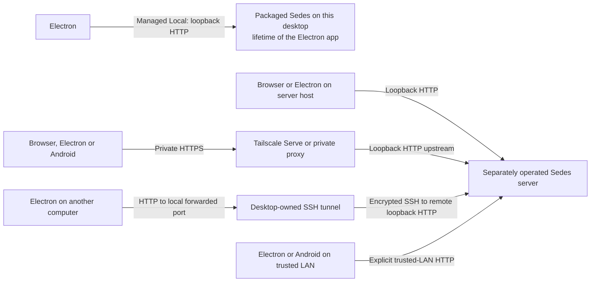
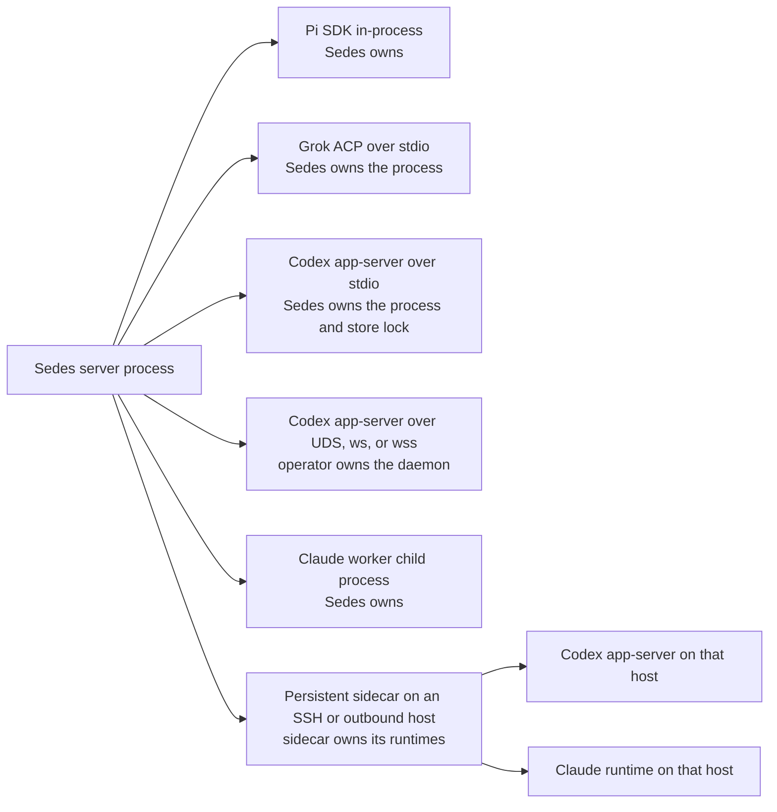
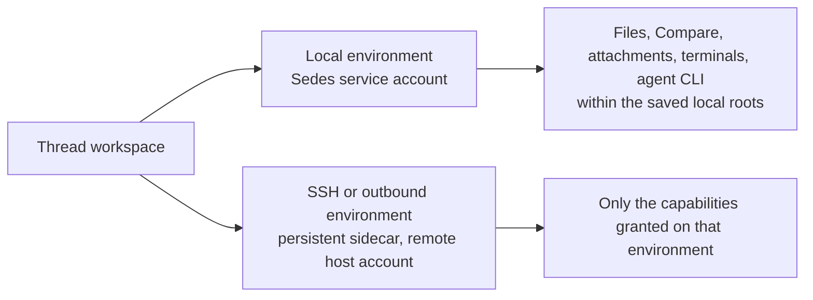
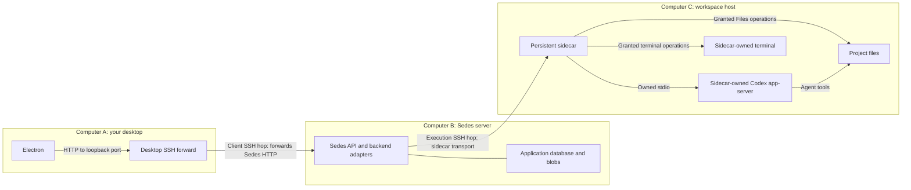
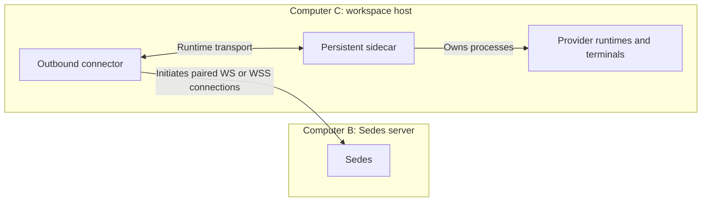

# Connection model

Sedes asks you to make three independent choices. Each one has its own hosts,
accounts, credentials, and failure modes, and none of them implies another:

1. **Client connection** — how a browser, Electron, or Android client reaches a
   Sedes server.
2. **Provider runtime connection** — how that Sedes server talks to each
   provider runtime (Pi, Codex, Claude, Grok).
3. **Execution environment** — where workspace operations, Files, agent tools,
   and terminals actually run for a thread.

The layers are independent because they are configured separately and use
separate authority:

- A working Codex transport to a remote app-server grants no Files, no
  attachments, no agent-tool CLI, and no terminals on that host. Those are
  separate sidecar capability grants on the execution environment.
- Electron's managed SSH connection forwards the Sedes HTTP port only. It does
  not start a remote Sedes daemon, and it is unrelated to an SSH execution
  environment: the two may use different hosts, accounts, and keys.
- An SSH or outbound execution environment does not move Pi's model loop,
  credentials, or conversation store off the Sedes host.
- Pairing a client authenticates it to the one Sedes principal. It grants no
  provider authority and does not change any execution grant.

## Vocabulary

"Local" means something different in each layer. Define it once per layer:

| Term | Layer | Meaning |
| --- | --- | --- |
| **Managed Local** | Client | The packaged Sedes server that Electron starts on your desktop for the lifetime of the application session. See [Use managed Local](clients/electron.md#use-managed-local). |
| **Local provider runtime** | Provider | A runtime on the machine running the Sedes server process, under the Sedes service account — not on your desktop, unless the desktop is the Sedes host. |
| **Local environment** | Execution | The Sedes server host's filesystem and service account. At most one local environment exists per installation. |
| **Sidecar SSH environment** | Execution | An OpenSSH host alias whose persistent sidecar performs granted operations under the remote account. |
| **Outbound environment** | Execution | A host whose connector dials this server; the same persistent sidecar operations, no inbound SSH. See [Outbound hosts](outbound-hosts.md). |
| **Managed TUI** | Provider | Codex's own interactive client, hosted where the Codex runtime lives. It is not an application terminal pane. |

## Layer 1: client to Sedes

Managed Local is the only client connection that creates a server; it ends when
Electron exits. Every other route reaches a separately operated server whose
lifetime is its own. Android offers Direct profiles only. Choose between these
routes in [Choose a connection](clients/index.md#choose-a-connection), and pair
each client as described in [Pairing clients](operations.md#pairing-clients).

## Layer 2: Sedes to the provider runtime

These are alternatives for one backend instance, not consecutive hops. Sedes
never starts, stops, or upgrades an operator-owned external daemon.

## Layer 3: execution environment

Grants are named per environment in **Settings → Environments**: see
[Execution environments](configuration.md#execution-environments). A granted
capability still requires the connected host to advertise matching support.

## Supported routes

| Backend | Provider runtime location | Transport options | Execution environments | What the route grants |
| --- | --- | --- | --- | --- |
| [Pi](backends/pi.md) | Always in the Sedes server process (pinned SDK) | In-process; nothing to configure | Local (direct, or Bubblewrap isolated on Linux); SSH sidecar; outbound sidecar | Remote workspaces need the `workspace_tools` and `workspace_context` pair, with `workspace_skills` optional. No Sedes CLI on remote or isolated workspaces: only the Native agent-tool modes. No managed TUI. |
| [Codex](backends/codex.md) | Sedes host, or the persistent sidecar's host | Owned stdio; external Unix-socket WebSocket; authenticated `ws://` on literal loopback or `wss://`. A sidecar-hosted runtime uses the same three, resolved on the execution host | Local (Linux x64, macOS arm64/x64, or Windows arm64/x64 through Electron Managed Local); SSH sidecar; outbound sidecar | Managed TUI on external UDS/TCP connections with a `catalog` model policy, plus local PTY support or a sidecar that negotiated the managed-TUI operations. Never on owned stdio. Files, attachments, terminals, and the CLI are separate grants. |
| [Claude](backends/claude.md) | Managed worker on the Sedes host, or the persistent sidecar's host | Sedes-owned worker child process locally; the same runtime protocol carried over SSH stdio or the outbound connector | Local and remote on Linux/macOS only; native Windows Claude is unsupported | Provider terminals and managed TUI are unsupported for every route. Files, attachments, and the CLI relay are separate grants. |
| [Grok](backends/grok.md) | Always the Sedes host | Sedes-owned ACP stdio | Local only, on Linux x64 or macOS arm64/x64. SSH and outbound environments are rejected | Sedes CLI agent tools on an active local thread. No managed TUI, no remote route, no external or shared daemon. |

The authoritative per-feature comparison stays in
[Capability differences](backends/index.md#capability-differences). What each
execution environment grants is the same for every backend that can run there:

| Capability | Local environment | SSH or outbound sidecar |
| --- | --- | --- |
| Directory browsing, Files, Compare | Within the saved local workspace roots | `directory_browser` and `workspace_files` |
| Composer attachments | Within the saved local workspace roots | `composer_attachments` |
| Pi workspace tools and context | Built in | `workspace_tools` plus `workspace_context`; `workspace_skills` for remote skills |
| Sedes agent-tool CLI | Eligible local threads on all four backends | `agent_tools_cli`, for Codex and Claude only |
| Application terminals | PTY from the service account | `interactive_terminal` plus native PTY assets on that host; see [Supported environments](terminals.md#supported-environments) |
| Codex managed TUI | External UDS/TCP connection with PTY support | Negotiated `codex_managed_tui` operations on the sidecar |

Combinations not listed above are unsupported: remote Grok, managed TUI over
owned stdio, native Windows Claude, a remote Sedes CLI for Pi, forks of
isolated Pi workspaces, and automatic fallback between transports.

## Recipes

### Everything on one Linux box

Browser on loopback, local environment, provider runtimes owned by the Sedes
service account. Layers 2 and 3 are both "this host". Provider credentials and
native conversation stores belong to that account; Sedes state lives in
`APP_STATE_DIR`. Restarting Sedes stops its owned provider processes and marks
local terminals interrupted; their retained history stays readable. See
[Deployment matrix](operations.md#deployment-matrix).

### Desktop Electron Local

Layer 1 is Managed Local; layers 2 and 3 are the desktop account. Configuration
and state live in Electron's `managed-local` user-data subtree, while Codex,
Claude, and Grok executables, logins, and native stores remain external to the
package. Quitting Electron stops the server, so active agents and terminals
end with the application session. This is the one route where "Local" in the
client chooser and "local" in an execution environment mean the same machine.

### Sedes on a server, Codex on a workstation

Run Sedes on the server, add the workstation as a Sidecar SSH environment (or
pair it as an [outbound host](outbound-hosts.md) when no inbound SSH is
possible), and configure the Codex backend for that environment. The server's
OpenSSH configuration supplies the route; Codex authentication, native store,
and any capability bearer resolve on the workstation account. Grant Files,
attachments, terminals, and the CLI explicitly — the provider transport grants
none of them. Restarting main Sedes leaves sidecar-hosted turns and terminals
running and reattaches to them; restarting the sidecar service interrupts its
PTYs and provider runtimes; restarting only an outbound connector detaches
access without stopping the sidecar's work. See
[Persistent remote services](operations.md#persistent-remote-services).

### Tailnet access

Keep the listener on loopback, put [Tailscale Serve](operations.md#tailscale-serve)
in front of it, admit the exact tailnet DNS Host, and save the resulting
`https://` origin as a Direct profile on Electron or Android. This changes
layer 1 only: provider runtimes and execution environments are unchanged, and
each device pairs separately with credentials bound to its profile and origin.
Restarting Serve interrupts client traffic, not provider work.

## Example: desktop → Sedes server → workspace host

Here the desktop reaches Sedes through Electron's SSH connection, while Sedes
uses a separate SSH environment for the agent and project. The two SSH hops
use different machines' OpenSSH configuration and may use different accounts.

The Codex process shown is owned by the sidecar. An external Codex daemon is
another supported choice, reached by UDS or authenticated WebSocket from the
execution host. In either case, Files and terminals need their own grants.
Restarting Sedes or losing either SSH connection does not stop sidecar-owned
work. Stopping the sidecar service does interrupt its processes.

An outbound environment replaces the **second** SSH hop, not the desktop's
connection to Sedes. The connector initiates the connection from Computer C:

The arrow to Sedes shows who opens the connection; traffic flows both ways.
The connector carries traffic, while the sidecar owns running work. Restarting
only the connector detaches access without stopping that work. See
[Outbound hosts](outbound-hosts.md) for pairing and setup.

## Diagnose one layer at a time

Client reachability, provider-runtime availability, and execution-environment
capabilities fail independently and report separately in Settings. Confirm the
client reached the intended server, then the backend's runtime status, then the
environment's granted operations, before changing configuration. Backend and
route troubleshooting continues in
[Common troubleshooting](backends/index.md#common-troubleshooting) and
[SSH or remote operations are unavailable](operations.md#ssh-or-remote-operations-are-unavailable).
